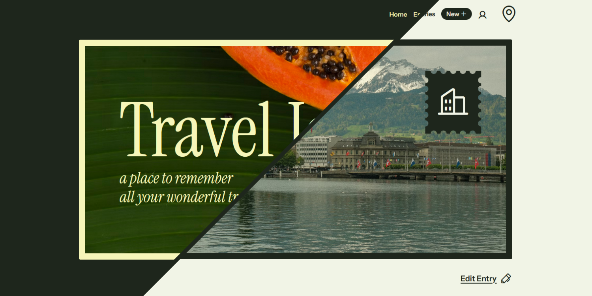
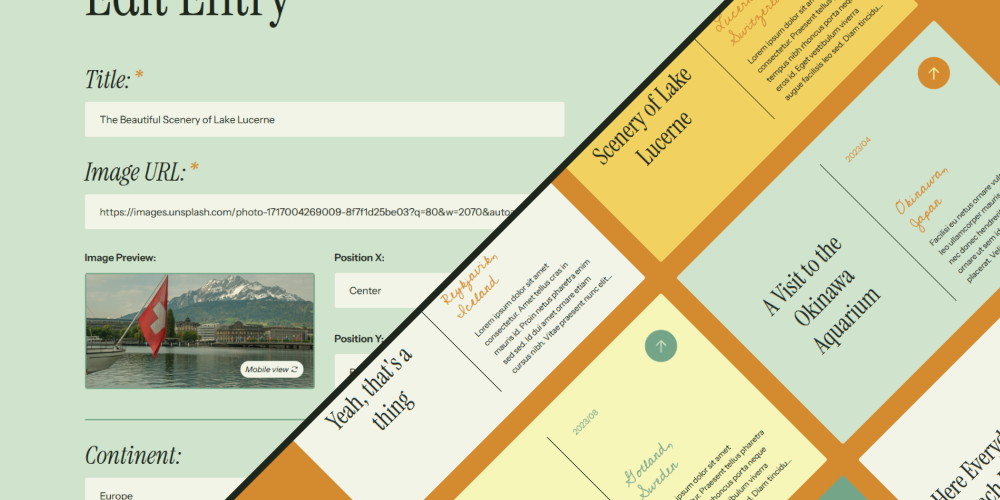
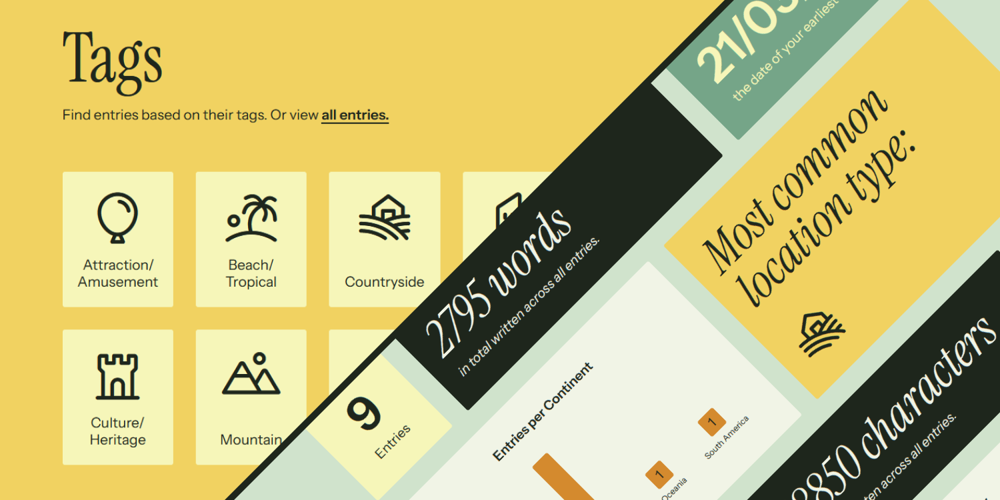

# Travel Journal - Individual Project React

> [View it here on Github Pages!](https://mikaelalundstrom.github.io/project-react-individual/)

Travel Journal is a personal travel journal/diary, a place to collect and organize journal entries related to your travels.

In the project I am using [my own data sets](https://github.com/mikaelalundstrom/json-data/tree/main/travel-journal) for some default entries and for the different location types. I am also using [REST Countries](https://restcountries.com/#endpoints-region) to get the list of countries for each continent.

## The Design

While the design for Travel Journal is inspired by vacation postcards, stamps, plane tickets, it still has the structure and some familiar elements of modern web design such as rounded corners, pill-shaped buttons, icons [(from Phosphor)](https://phosphoricons.com/) and so on. In this way the design feels fresh, familiar, and nostalgic all at the same time.

The page was designed with desktop in mind, but is responsive with mobile screen sizes and dimensions.

## The Entries

The entries consist of three main components: A title, an image and a desription. Every entry also has a date and a location, with more detailed location info being optional. There is a tag system to organize and filter your entries based on either location type, country or continent.

## Form to Create, Update & Delete

As a user, you are able to update, delete and create new entries as you like. Some fields in the form are requiered, while others are optional. In the form you can also see a preview of the picture you choose for your entry, as well as adjust the positioning of it, and you can toggle between seeing the image crop as it would look in desktop/mobile view.

When creating a new entry, it automatically redirects you to the page of the newly created entry. If you were to delete an entry, you get redirected to the Entries page instead.

## Profile & Statistics

A profile page exist where the user can enter some personal info, and also see some statistics from their travel journal, such as most common countries or amount of words written.

